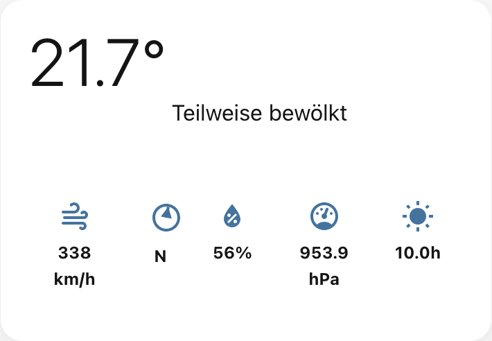
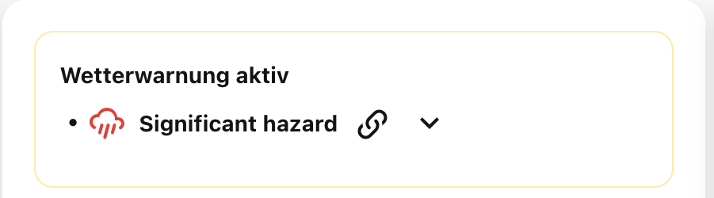
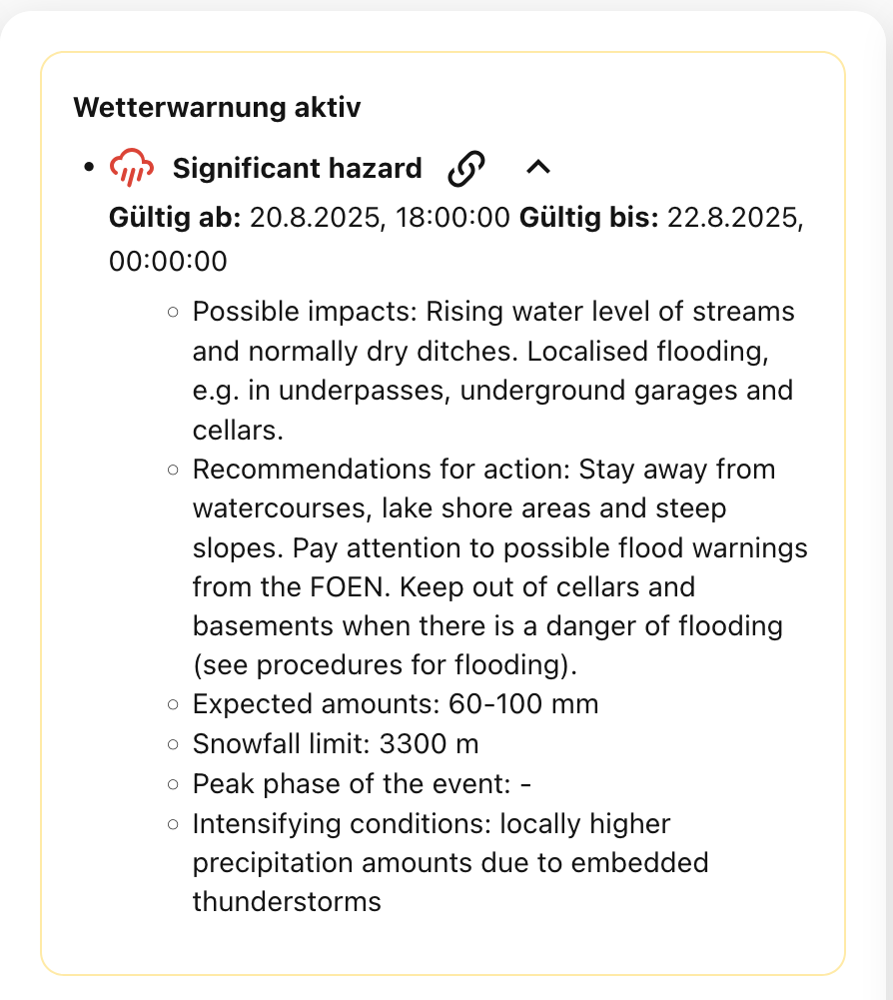

# Release Notes

## [1.3.0] - 2025-08-23

### Added
- compact mode of additional informations of the day (like windspeed or humidity)

## [1.2.0] - 2025-08-22

### Added
- redesigned the warning display
- collapsible warning description

---

### Added

## [1.1.0] - 2025-08-21

### Added
- Visual Editor: Added options for `show_wind` and `enable_animate_weather_icons`
- Animated weather icons can be enabled/disabled

### Fixed
- TypeScript and ESLint errors in CI/CD workflows

### Removed
- Deprecated `precipitation_entity` option (was not using)
- Unused files and non-HACS relevant files from the repository

### Other Changes
- adjusted documentations
- added more screenshots

---

## [1.0.0] - 2025-08-17

### ✨ Features
- **Initial release** of the SwissWeather Card
- **TypeScript-based implementation** for better developer experience
- **Home Assistant 2025.8+ compatibility**
- **Modern Lit Elements 3.x** with decorators

### 🎨 Design
- **Responsive layout** for mobile and desktop
- **Glassmorphism effects** for a modern look
- **Accessibility standards** (WCAG 2.1)

### 📊 Functionality
- **Weather warnings** with color-coded alert levels (1-5)
- **7-day weather forecast** with icons and temperatures
- **Wind compass** with graphical direction indicator
- **Precipitation chart** for 6h forecast
- **Sunshine duration** and UV index
- **Humidity, pressure, visibility**

### 🔧 Technical
- **ES2022** target for modern browsers
- **Yarn 4+** package manager with PnP
- **ESLint + Prettier** for code quality
- **Strict TypeScript** for type safety

### 📦 HACS Integration
- **HACS-compatible structure**
- **Automatic updates** via HACS
- **Easy installation** with one click

### 🌐 Localization
- **German translations** for all UI elements
- **Local date formats** (Sun, Mon, Tue, etc.)

### 🔌 Integrations
- **hass-swissweather** integration (recommended)
- **Generic weather** entities

### 📱 Responsive Design
- **Mobile-first** approach
- **Touch-friendly** interface
- **Adaptive layouts** depending on screen size
- **Optimized performance** on all devices

---

## Roadmap

### 🔄 Version 1.x.0
- [ ] **chart ordering** add configuration to ordering charts
