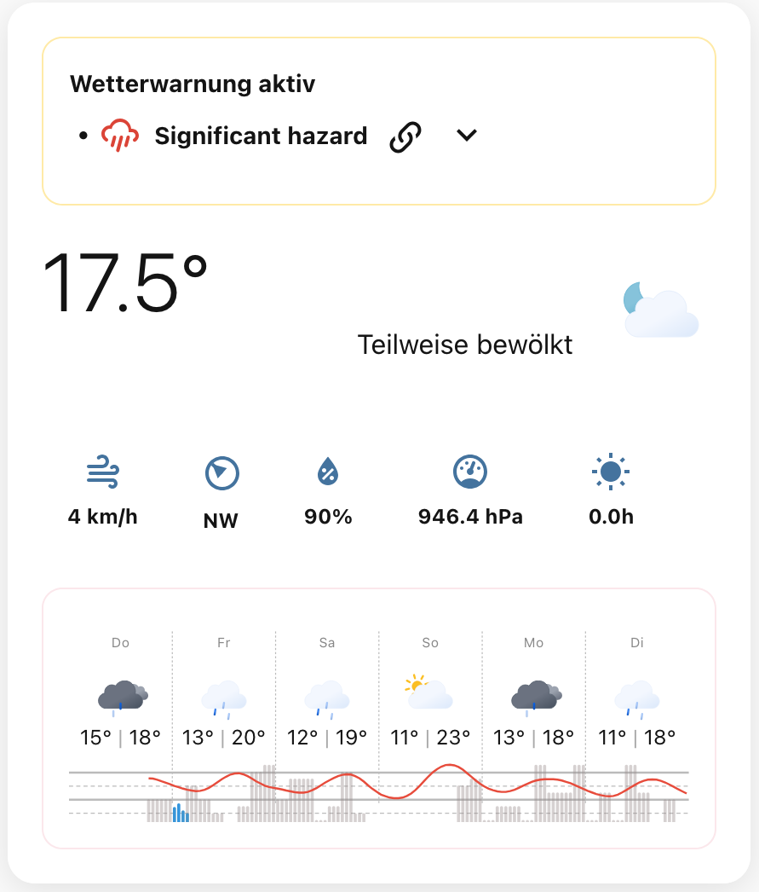
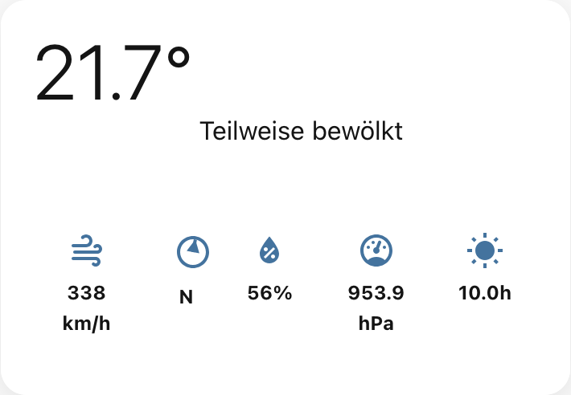
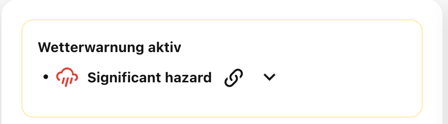
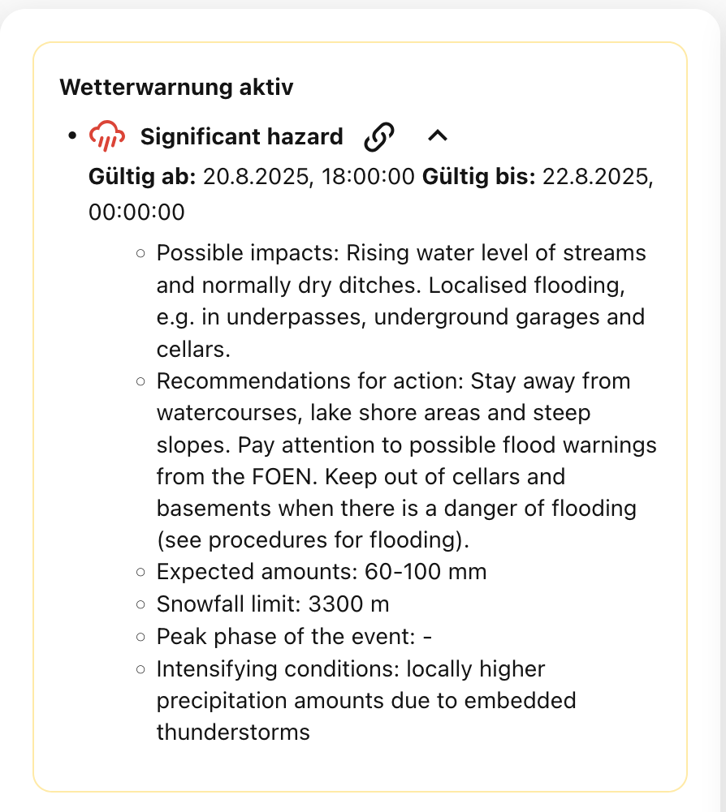

# Release Notes

## [1.10.7] - 2026-09-04

### Fixed
- Added English fallback translations for unsupported Home Assistant UI languages.

## [1.10.6] - 2026-09-03

### Fixed
- Fixed malformed HTML/SVG closing tags that could prevent the card from rendering in Home Assistant 2026.9.

## [1.9.0] - 2026-05-04

### Added
- **New `swissweather-pollen-card`** — standalone card showing Swiss pollen levels from [izacus/hass-swissweather](https://github.com/izacus/hass-swissweather) sensors.
  - Supports 7 pollen types: Birch, Grasses, Alder, Hazel, Beech, Ash, Oak.
  - Per-type enable/disable toggle in the Visual Editor.
  - Level sensor (NONE/LOW/MEDIUM/STRONG/VERY_STRONG) and optional raw particle sensor per type.
  - Overall severity badge (highest active level) with collapsible detail grid.
  - Color-coded levels via CSS custom properties for theming.

### Changed
- **Translation namespace refactor** — translation keys are now grouped by card scope:
  - `warning.*` — warning card display strings and entity config
  - `hourly_charts.*` — all hourly/daily chart display strings and editor config
  - `bg_card.*` — background card display and editor config (forecast_mode, sunrise/sunset)
  - `forecast_diagram.*` — forecast diagram editor config
  - `pollen.*` — pollen card types, levels, and editor config
  - `config.*` stays the full card namespace (full card may still mix all namespaces)

## [1.8.1] - 2026-04-15

### Added
- Translation files split into per-language JSON files (`src/translations/de.json`, `src/translations/en.json`) — easier to maintain and extend with new languages.

### Fixed
- Missing `7d_forecast` translation key — the full card showed `[7d_forecast]` as literal text instead of "7-Tage-Prognose" / "7-day forecast".

### Changed
- Rebuilt artifact with vite 8.0.8 (`@oxc-project/runtime` 0.123 → 0.124).

## [1.8.0] - 2026-04-15

### Added
- **Ranked warning model support** — full compatibility with mastameista's `hass-swissweather` fork (API v2).
  - New `primary_warning_entity`, `secondary_warning_entity`, `tertiary_warning_entity` entity pickers in the full card Visual Editor.
  - Auto-detection: if `has_warning` attribute is present on the primary entity, the ranked model is used; otherwise falls back to the legacy aggregated sensor (izacus/hass-swissweather).
  - Warning count shown in the section title ("2 weather warnings active").
  - +N badge on the primary slot only shows warnings hidden beyond secondary/tertiary slots.
  - Expand/collapse per warning slot with validity period, HTML text, and links.
  - Icons derived from `warning_type`; color from `icon_color` (yellow/orange/red/violet/gray).
  - Null-text handling for warnings without text (e.g. avalanche bulletins — links still render).
- **Standalone `swissweather-warning-card`** — dedicated card showing only weather warnings, configurable with the three ranked entities independently of the full weather card.

### Changed
- Warning rendering logic extracted into a shared utility (`src/utils/warning-renderer.ts`) — single source of truth used by both the full card and the standalone warning card.
- Async translation loading fixed: warning title now appears immediately on first render.

### Fixed
- Warning section layout on the full card (title and list were rendering side-by-side due to leftover `display: flex`).
- Expand button on the full card now triggers re-render correctly (missing `requestUpdate()`).
- Expand button stays pinned to the right in narrow layouts (4-section dashboard view).

### Migration Notes
- Existing configs with `warning_entity` continue to work unchanged (legacy fallback).
- To use the ranked model, configure `primary_warning_entity` (and optionally secondary/tertiary) in the Visual Editor. No `warning_entity` is needed.

### Acknowledgements
- Many thanks to [@mastameista](https://github.com/mastameista) for the idea, implementation input, and thorough beta testing of the ranked warning model across b1–b4.

## [1.7.0] - 2026-03-28

### Added
- New standalone cards for hourly charts: temperature, precipitation, sunshine, and wind.
- Daily forecast diagram standalone card.
- Rebuilt hourly charts (temperature, precipitation, sunshine, and wind) with SVG-based rendering.
- Added chart grid lines and improved chart readability/visual structure.
- Automatic forecast inclusion in effective `chart_order` when forecast is enabled.

### Changed
- Standalone cards now use responsive sizing with propagated width/height to chart and SVG containers.
- Standalone chart styling was compacted (reduced inner spacing, consistent border/margin handling).
- Updated chart visual design and layout behavior across all rebuilt hourly charts.
- Forecast rendering logic was aligned so `show_forecast` and `compact_mode` behave consistently.
- Changelog screenshot filenames were renamed to version-related names.

### Fixed
- Standalone cards no longer get stuck on loading in forecast fetch scenarios.
- Grid row handling for standalone cards now uses consistent defaults and metadata.
- Removed remaining fixed-height behaviors that caused clipping/oversizing in sections.
- Fixed bottom-gap issues in standalone charts and standalone forecast diagram.
- Full-width chart host behavior for standalone cards.
- Visual editor defaults for forecast/chart toggles and persisted config handling.
- Removed/cleaned debug logs introduced during beta troubleshooting.

### Migration Notes
- Older configs without `forecast` in `chart_order` continue to work; `forecast` is auto-added when `show_forecast` is enabled.
- If legacy dashboard sections show outdated sizing, open the card editor once and save to refresh stored grid options.

## [1.6.0] - 2025-10-16

### Added
- new "sub" cards are available
  * Animated Background Card
  * Daily Forecast Diagram Card

## [1.5.2] - 2025-09-07

### Fixed
- fixed displaying daily forecast (non compact mode)

## [1.5.1] - 2025-09-04

### Fixed
- missing show_location entry on visual editor
- fixed fog animate svg icon

### Added
- description on visual editor configuration

## [1.5.0] - 2025-09-02

### Fixed
- some configuration details was removed in visual editor (like show_temperature, forecast_hours)
- sunset and sunrise displaying was 1 hour to late

### Added
- a little bit more structure in the Visual Editor
- configurable order of charts incl. forecast

### Changed
- structure of chart code changed

## [1.4.2] - 2025-09-01

## Fixed
- show the right animated weather image for lightning-rainy
- namimg of "lightning-rainy" is adjusted

## [1.4.1] - 2025-08-30

### Fixed
- disabled some debug logs
- correcting the isday handling to show the right partly cloudy
- adjusted some documentations

## [1.4.0] - 2025-08-28

### Added
- Compact mode for the daily forecast
- Display hourly temperature as a line chart
- Display hourly precipitation and precipitation probability as bar charts in the same chart

### Changed

- Use night and day variants for the partly cloudy icon
- Use extreme rain icon for pouring
- Show precipitation probability in the precipitation chart

## [1.3.1] - 2025-08-24

- the github release workflow have uploaded the zip file with version number, but not the js file itself
- with this changes it should be available via HACS again (the last 2 version 1.2.0 and 1.3.0 are not working)

## [1.3.0] - 2025-08-23

### Added
- compact mode of additional informations of the day (like windspeed or humidity)

## [1.2.0] - 2025-08-22

### Added
- redesigned the warning display
- collapsible warning description

---

### Added

## [1.1.0] - 2025-08-21

### Added
- Visual Editor: Added options for `show_wind` and `enable_animate_weather_icons`
- Animated weather icons can be enabled/disabled

### Fixed
- TypeScript and ESLint errors in CI/CD workflows

### Removed
- Deprecated `precipitation_entity` option (was not using)
- Unused files and non-HACS relevant files from the repository

### Other Changes
- adjusted documentations
- added more screenshots

---

## [1.0.0] - 2025-08-17

### ✨ Features
- **Initial release** of the SwissWeather Card
- **TypeScript-based implementation** for better developer experience
- **Home Assistant 2025.8+ compatibility**
- **Modern Lit Elements 3.x** with decorators

### 🎨 Design
- **Responsive layout** for mobile and desktop
- **Glassmorphism effects** for a modern look
- **Accessibility standards** (WCAG 2.1)

### 📊 Functionality
- **Weather warnings** with color-coded alert levels (1-5)
- **7-day weather forecast** with icons and temperatures
- **Wind compass** with graphical direction indicator
- **Precipitation chart** for 6h forecast
- **Sunshine duration** and UV index
- **Humidity, pressure, visibility**

### 🔧 Technical
- **ES2022** target for modern browsers
- **Yarn 4+** package manager with PnP
- **ESLint + Prettier** for code quality
- **Strict TypeScript** for type safety

### 📦 HACS Integration
- **HACS-compatible structure**
- **Automatic updates** via HACS
- **Easy installation** with one click

### 🌐 Localization
- **German translations** for all UI elements
- **Local date formats** (Sun, Mon, Tue, etc.)

### 🔌 Integrations
- **hass-swissweather** integration (recommended)
- **Generic weather** entities

### 📱 Responsive Design
- **Mobile-first** approach
- **Touch-friendly** interface
- **Adaptive layouts** depending on screen size
- **Optimized performance** on all devices

---

## Roadmap

### 🔄 Version 1.x.0
- [ ] **chart ordering** add configuration to ordering charts
