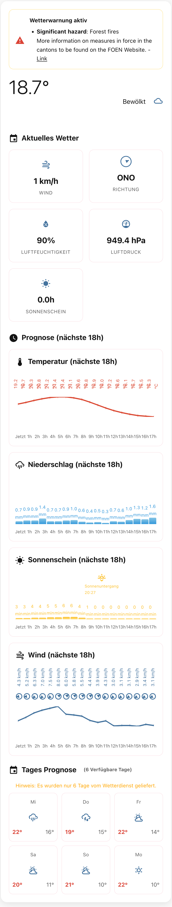

> **A modern Home Assistant custom card for Swiss weather, warnings, and forecasts. Integrates with hass-swissweather for accurate Swiss data.**

# SwissWeather Home Assistant Card

A custom Home Assistant card that recreates the look and feel of the official SwissWeather app. **Optimized for Home Assistant 2025.8+ with TypeScript and modern web standards.**

## ⭐ Features

### 🚨 **Weather Warnings**
- Color-coded warning levels (green, yellow, orange, red, violet)
- Current alerts for selected regions
- Icons for various weather hazards
- Automatic display when warnings are active

### 🌧️ **Precipitation & Forecast**
- Hourly precipitation forecast with bar chart  
- 7-day weather forecast with icons
- Precipitation probability
- Radar-like visualization

### ☀️ **Sunshine & UV**
- Daily sunshine duration in hours
- Integration with HA sunshine sensors
- UV index support
- Gust forecast and Beaufort scale
- Min/Max temperatures

- ✅ **Entity picker** for all sensors
- **German localization** for all labels
- **No separate files** – everything in `swissweather-card.js`

## 🛠️ Installation

### HACS (recommended)
1. Add this URL as a custom repository: `https://github.com/your-username/ha-swissweather-card`
2. Search for "SwissWeather Card" and install it

### Manual
1. Download the latest `swissweather-card.js` from [Releases](https://github.com/your-username/ha-swissweather-card/releases)
2. Copy it to your `config/www/` folder
3. Add the resource:

```yaml
# configuration.yaml
lovelace:
  resources:
    - url: /local/swissweather-card.js
      type: module  # Important for HA 2025.8+
```

4. Restart Home Assistant

## 🎨 Visual Editor

The SwissWeather Card comes with a full visual editor for the Lovelace UI:

- **Responsive**: Optimized for desktop and mobile

### Usage:
1. **Edit dashboard** → **Add card**
2. Select **"SwissWeather Card"** from the list
3. Configure entities using the dropdown menus
4. Adjust options with the toggles
5. **Save** – done!

#### 📊 Additional Sensors (Optional)

#### 🎨 Display Options
- **Weather forecast**: Toggle 7-day forecast
- **Precipitation chart**: Toggle hourly chart  
- **Weather warnings**: Toggle warning display
- **Compact mode**: Smaller card for mobile devices

## ⚙️ Configuration

### Basic Configuration
```yaml
type: custom:swissweather-card
entity: weather.home
location: "Zurich"
```


### Full Configuration
```yaml
type: custom:swissweather-card
entity: weather.openweathermap
location: "Zurich"
show_location: true
warning_entity: sensor.meteoswiss_warnings
wind_entity: sensor.wind_speed
wind_direction_entity: sensor.wind_bearing
sunshine_entity: sensor.sunshine_duration
precipitation_entity: sensor.precipitation_forecast
sun_entity: sun.sun
show_forecast: true
forecast_hours: 12
show_hourly: true
show_temperature: true
show_sunshine: true
show_warnings: true
show_precipitation: true
compact_mode: false
theme: auto
```

### Options

| Option                | Type    | Default      | Description                       |
|-----------------------|---------|--------------|-----------------------------------|
| `entity`              | string  | **Required** | Main weather entity               |
| `location`            | string  | "Switzerland" | Displayed location                |
| `warning_entity`      | string  | Optional     | Entity for weather warnings        |
| `wind_entity`         | string  | Optional     | Entity for wind speed              |
| `wind_direction_entity`| string | Optional     | Entity for wind direction          |
| `sunshine_entity`     | string  | Optional     | Entity for sunshine duration       |
| `precipitation_entity`| string  | Optional     | Entity for precipitation forecast  |
| `show_forecast`       | boolean | `true`       | Show 7-day forecast               |
| `show_hourly`         | boolean | `true`       | Show hourly forecast              |
| `show_warnings`       | boolean | `true`       | Show weather warnings             |
| `show_precipitation`  | boolean | `true`       | Show precipitation chart          |
| `compact_mode`        | boolean | `false`      | Compact view                      |
| `theme`               | string  | "auto"      | Theme: `light`, `dark`, `auto`    |

## 🔧 Recommended Integrations

### hass-swissweather

This card is compatible with the [hass-swissweather](https://github.com/izacus/hass-swissweather) integration by @izacus, which provides high-quality Swiss weather data and warnings directly in Home Assistant. For best results, use this integration as your data source for weather, warnings, and sensor entities.

## 🛠️ Development

### Requirements
- Node.js 18+
- Yarn 4+

### Setup
```bash
git clone https://github.com/your-username/ha-swissweather-card.git
cd ha-swissweather-card
yarn dev          # Development with live reload
yarn type-check   # TypeScript check
yarn lint         # Code linting
yarn format       # Code formatting
yarn build        # Production build
```

### Demo
```bash
# Open demo in browser
open demo.html
```

- **Responsive grid layout**
- **Accessibility standards (WCAG 2.1)**

## 📱 Screenshots

| Desktop | Mobile | Dark Theme |
|---------|--------|------------|
|  |  |  |

## 🤝 Contributing

1. Fork the repository
2. Create a feature branch: `git checkout -b feature/amazing-feature`
3. Commit your changes: `git commit -m 'Add amazing feature'`
4. Push to the branch: `git push origin feature/amazing-feature`
5. Open a pull request

## 📋 Requirements

### Home Assistant
- **Home Assistant 2025.8+** (for best compatibility)
- **Modern browser** with ES2022 support

### Browser Support
- ✅ Edge 90+

**Possible causes and solutions:**

     resources:
       - url: /hacsfiles/swissweather-card/swissweather-card.js
         type: module
   ```

2. **Cache issue**
   - Clear browser cache (Ctrl+F5 or Cmd+Shift+R)
   - Restart Home Assistant

3. **Check file path**
   - HACS: `/hacsfiles/swissweather-card/swissweather-card.js`
   - Manual: `/local/swissweather-card.js` (if in `config/www/`)

4. **Check browser console**
   - Open F12 → Console tab
   - Look for JavaScript errors

5. **Home Assistant version**
   - At least Home Assistant 2025.8+ required
   - TypeScript-based custom cards require modern browsers

### Other common issues

- **Entity not found**: Check if `entity: weather.xyz` exists in HA
- **No data**: Is the weather integration configured correctly?
- **Layout issues**: Set browser zoom to 100%

## 🔗 Links

- [📖 Documentation](docs/)
- [🐛 Bug Reports](https://github.com/your-username/ha-swissweather-card/issues)
- [💡 Feature Requests](https://github.com/your-username/ha-swissweather-card/discussions)
- [📋 Changelog](CHANGELOG.md)

## 📄 License

MIT License – see [LICENSE](LICENSE) file

## 🙏 Acknowledgements

- **MeteoSwiss** for the inspiration
- **Home Assistant Community** for the support
- **Lit Team** for the great web components library

---

⭐ **Like this card? Give the repository a star!**
